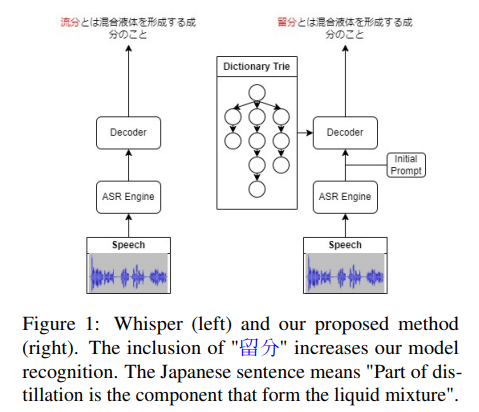
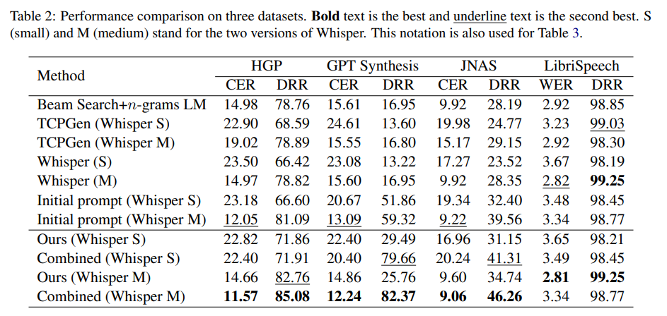

# Improving Speech Recognition with Jargon Injection

## Introduction

We introduce a new method that improves the performance of Automatic speech recognition (ASR) engines, e.g., Whisper in practical cases. Different from prior methods that usually require both speech data and its transcription for decoding, our method only uses jargon as the context for decoding. To do that, the method first represents the jargon in a trie tree structure for efficient storing and traversing. The method next forces the decoding of Whisper to more focus on the jargon by adjusting the probability of generated tokens with the use of the trie tree. To further improve the performance, the method utilizes the prompting method that uses the jargon as the context. Final tokens are generated based on the combination of prompting and decoding. Experimental results on Japanese and English datasets show that the proposed method helps to improve the performance of Whisper, specially for domain-specific data. The method is simple but effective and can be deployed to any encoder-decoder ASR engines in actual cases.

<div align="center">

</div>

[//]: # '<div align="center"> </div>'

<div align="center">
<h4>
<a href="https://aclanthology.org/2024.sigdial-1.42/"> Paper </a>
｜<a href="#Benchmarks"> Benchmarks </a>
｜<a href="#Install"> Install </a>
｜<a href="#Usage"> Usage </a>
</h4>
</div>

## Benchmarks

<div align="center">

</div>

## Install

```
pip install -r requirements.txt
```

## Usage

- [JNAS](recipes/jnas/)
- [HGP-600](recipes/hgp-600/)
- [Libri](recipes/libri/)

### Inference

Run `inference.py` in each recipe, which corresponds to each benchmark dataset.
For example:

```bash
python recipes/jnas/inference.py
```

### Finetune

Finetune the Whisper ASR model with and without Jargon Injection by running `train.py` in each recipe
For example:

```bash
python recipes/hgp-600/train.py
```
